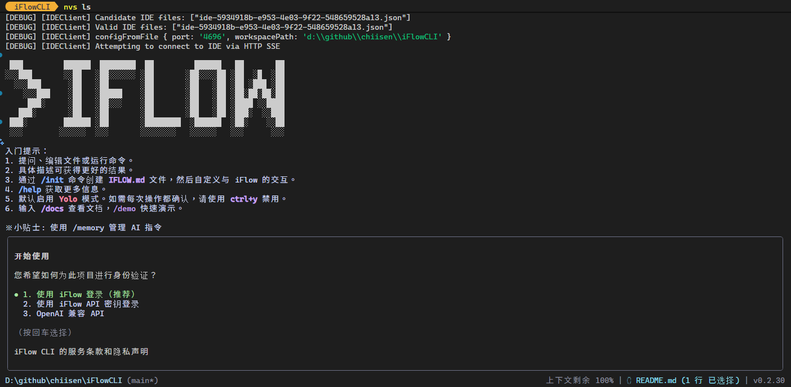

# iFlowCLI ✨

iFlow CLI (命令列界面) 專案 🌟  
iFlow 是一款 AI 驅動的開發工具，專為提升開發效率而設計 🚀



## 官網 🌐

### 技術文件 📚
https://platform.iflow.cn/cli/quickstart/index.html

### 線上客服 💬
https://iflow.cn/

## 安裝 💻

**環境需求**  
- ⚠️ Windows 系統  
- 📦 Node.js 22+  

```bash
npm install -g @iflow-ai/iflow-cli@latest
```

## 啟動 🚀

```bash
iflow

iflow --version
```

```bash
 ╭───────────────────────────────────────────────────────────────────────────────────────────────────────────────────────────────────────────────────────────────────────────────────╮
 │ ✅ todo_write 更新待辦事項列表（0個待處理，0個進行中，9個已完成）                                                                                                                 │
 │                                                                                                                                                                                   │
 │    ·已更新待辦事項列表                                                                                                                                                            │
 │      ⎿ ✅ 創建打磚塊遊戲HTML文件                                                                                                                                                  │
 │        ✅ 設計遊戲HTML結構                                                                                                                                                        │
 │        ✅ 實現遊戲Canvas繪圖                                                                                                                                                      │
 │        ✅ 添加遊戲邏輯JavaScript代碼                                                                                                                                              │
 │        ✅ 實現磚塊消除功能                                                                                                                                                        │
 │        ✅ 添加小球反彈物理效果                                                                                                                                                    │
 │        ✅ 實現擋板控制                                                                                                                                                            │
 │        ✅ 添加遊戲結束和勝利條件                                                                                                                                                  │
 │        ✅ 優化遊戲體驗和界面                                                                                                                                                      │
 ╰───────────────────────────────────────────────────────────────────────────────────────────────────────────────────────────────────────────────────────────────────────────────────╯
 ```
 🎉 我已經為您創建了一個完整的打磚塊遊戲 HTML 文件！遊戲包含以下特色：


  1. 🎮 經典的打磚塊遊戲玩法  
  2. 🖱️ 滑鼠和鍵盤 (方向鍵) 控制擋板  
  3. 🧱 磚塊碰撞檢測和消除  
  4. 📊 得分系統和生命系統  
  5. 🏆 遊戲勝利和失敗條件  
  6. ⚡ 小球反彈物理效果  
  7. 🎨 簡潔美觀的界面設計  

  遊戲檔案已儲存為 `breakout_game.html`，您可以直接在瀏覽器中打開來遊玩 🎯

  ### 遊戲控制說明 🎯
  - 🖱️ 使用滑鼠移動擋板  
  - ⌨️ 或使用鍵盤左 (←) 右 (→) 方向鍵控制擋板  
  - 🖱️ 點擊遊戲區域可以重新開始遊戲  
